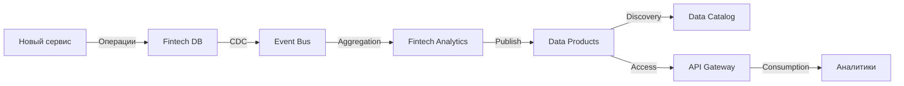

# Обоснование разделения системы на домены для компании "Будущее 2.0"

## Оглавление
1. [Принципы разделения на домены](#принципы-разделения-на-домены)
2. [Описание выделенных доменов](#описание-выделенных-доменов)
3. [Потоки данных между доменами](#потоки-данных-между-доменами)
4. [Поддержка бизнес-сценариев](#поддержка-бизнес-сценариев)
5. [Бизнес-преимущества](#бизнес-преимущества)
6. [Обоснование архитектурных решений](#обоснование-архитектурных-решений)

---

## Принципы разделения на домены

### Методология Domain-Driven Design (DDD)

Разделение системы на домены основано на принципах **Domain-Driven Design** и **Data Mesh**, с фокусом на:

#### 1. **Bounded Context (Ограниченный контекст)**
Каждый домен имеет четкие границы и собственную бизнес-логику:
- Медицинский домен оперирует понятиями: пациент, прием, диагноз, лечение
- Финтех домен: клиент, счет, кредит, транзакция, платеж
- AI домен: модель, inference, метрики качества, эксперименты
- Корпоративный домен: сотрудник, зарплата, инвентарь, бюджет

#### 2. **Organizational Alignment (Организационное выравнивание)**
Каждый домен соответствует бизнес-подразделению:
- Медицинский → Клиники
- AI → Компания AI-сервисов
- Финтех → Банковское подразделение
- Корпоративный → Головной офис

#### 3. **Data Ownership (Владение данными)**
Каждый домен:
- Владеет своими данными
- Отвечает за качество данных
- Определяет схемы и контракты
- Управляет жизненным циклом данных

#### 4. **Data as a Product (Данные как продукт)**
Домены публикуют **Data Products** - готовые для потребления наборы данных:
- С документированными API
- С гарантиями SLA
- С метриками качества
- С понятной семантикой

---

## Описание выделенных доменов

### 1. 🏥 Медицинский домен (Medical Domain)

**Бизнес-назначение:**
Поддержка операционной деятельности клиник и предоставление медицинской аналитики.

**Основные компоненты:**

| Компонент | Назначение | Технологии |
|-----------|------------|------------|
| **Операционная система клиник** | Записи пациентов, расписание врачей, ведение приемов | Новое web-приложение (замена PowerBuilder) |
| **Medical Data Lake** | Хранение медицинских карт, истории болезней, результатов исследований | S3/Azure Data Lake с шифрованием |
| **Medical Analytics DB** | Агрегированные данные БЕЗ PII для аналитики | Snowflake/BigQuery/Redshift |
| **Medical Data Products** | • Статистика посещений<br>• Загрузка клиник<br>• Эффективность лечения<br>• Инвентаризация оборудования | REST API + Event Streaming |

**Границы домена:**
- ✅ Включает: операционные данные клиник, статистику, показатели эффективности
- ❌ Исключает: финансовые операции (передаются в Fintech), обучение AI-моделей (в AI Domain)

**Обоснование:**
- Медицинские данные подчиняются строгим регуляторным требованиям (152-ФЗ, ПДн)
- Разделение операционных (с PII) и аналитических данных критично для безопасности
- Клиники должны работать независимо от других направлений бизнеса

---

### 2. 🤖 AI домен (AI Domain)

**Бизнес-назначение:**
Разработка, обучение и эксплуатация AI-моделей для медицинской диагностики и анализа.

**Основные компоненты:**

| Компонент | Назначение | Технологии |
|-----------|------------|------------|
| **ML Platform** | Обучение и эксперименты с ML моделями | Kubeflow/SageMaker/Azure ML |
| **AI Models Registry** | Хранилище обученных моделей и версий | MLflow/Model Registry |
| **Inference Services** | Сервисы для запуска диагностики в real-time | Python/FastAPI + GPU |
| **Feature Store** | Хранилище фичей для ML | Feast/Tecton |
| **AI Data Products** | • Метрики качества моделей<br>• Эффективность диагностики<br>• Результаты A/B тестов | API + Streaming |

**Границы домена:**
- ✅ Включает: модели, эксперименты, inference, метрики AI
- ❌ Исключает: сырые медицинские данные (получает анонимизированные из Medical Domain)

**Обоснование:**
- AI требует специфических технологий и компетенций (GPU, MLOps)
- Частые итерации и эксперименты не должны влиять на операционные системы
- Изоляция предотвращает утечку медицинских данных при обучении моделей
- Возможность масштабирования compute-ресурсов независимо

---

### 3. 💳 Финтех домен (Fintech Domain)

**Бизнес-назначение:**
Предоставление финансовых и банковских услуг клиентам.

**Основные компоненты:**

| Компонент | Назначение | Технологии |
|-----------|------------|------------|
| **Fintech Services** | Кредиты, счета, платежи, банковские операции | Golang/Java microservices |
| **Fintech Operational DB** | Транзакционные данные | PostgreSQL/MySQL с репликацией |
| **Fintech Analytics DWH** | Финансовая аналитика и отчетность | Snowflake/BigQuery |
| **Compliance & Security** | AML, KYC, аудит, соответствие ЦБ РФ | Специализированные системы |
| **Fintech Data Products** | • Кредитный скоринг<br>• Финансовая отчетность<br>• Анализ рисков<br>• NPS и churn-анализ | API + Streaming |

**Границы домена:**
- ✅ Включает: все финансовые операции, банковские услуги, compliance
- ❌ Исключает: медицинские данные (получает только агрегированную статистику для скоринга)

**Обоснование:**
- Банковская деятельность требует соответствия регуляторным требованиям ЦБ РФ
- Финансовые данные критичны и требуют специальных мер безопасности
- Финтех-направление должно развиваться независимо от медицинского бизнеса
- Банковская лицензия накладывает требования на изоляцию данных

---

### 4. 🏢 Корпоративный домен (Corporate Domain)

**Бизнес-назначение:**
Поддержка корпоративных функций головного офиса и консолидированной отчетности.

**Основные компоненты:**

| Компонент | Назначение | Технологии |
|-----------|------------|------------|
| **HR System** | Управление персоналом, зарплаты, расписание | Современная HRM система |
| **ERP System** | Финансовый учет, бухгалтерия | ERP (SAP/Oracle/1С) |
| **CRM** | Управление клиентскими отношениями | CRM система |
| **Inventory System** | Управление оборудованием, закупки | Inventory management |
| **Corporate Analytics DWH** | Консолидированные данные | Snowflake/BigQuery |
| **Corporate Data Products** | • Консолидированная отчетность<br>• KPI по доменам<br>• Операционная эффективность<br>• Стратегические метрики | API + Dashboards |

**Границы домена:**
- ✅ Включает: HR, финансовый учет, инвентаризация, CRM, консолидация
- ❌ Исключает: операционные данные бизнес-доменов (получает через Data Products)

**Обоснование:**
- Корпоративные функции обслуживают все направления бизнеса
- Требуется консолидированный взгляд на компанию для руководства
- Независимое развитие корпоративных систем от операционных

---

### 5. 💊 Фармацевтический домен (Pharma Domain) - Будущий

**Бизнес-назначение:**
Интеграция фармацевтических компаний для управления поставками и назначениями лекарств.

**Планируемые компоненты:**

| Компонент | Назначение |
|-----------|------------|
| **Pharmacy Services** | Управление рецептами, поставки лекарств, взаимодействие с аптеками |
| **Drug Database** | Справочник лекарств, взаимодействия, противопоказания |
| **Pharma Data Products** | • Назначения лекарств<br>• Эффективность препаратов<br>• Статистика поставок |

**Обоснование:**
- Фармацевтика - отдельный бизнес с собственными процессами
- Требуется интеграция с внешними фармкомпаниями
- Изоляция снижает риски при подключении новых партнеров

---

### 6. 🔧 Домен производства медоборудования (Device Manufacturing Domain) - Будущий

**Бизнес-назначение:**
Интеграция производителей медицинского оборудования для мониторинга и обслуживания.

**Планируемые компоненты:**

| Компонент | Назначение |
|-----------|------------|
| **Device Management** | Учет оборудования, техобслуживание, мониторинг состояния |
| **IoT Data Stream** | Данные с медицинского оборудования в реальном времени |
| **Device Data Products** | • Состояние оборудования<br>• Графики обслуживания<br>• Прогнозирование поломок |

**Обоснование:**
- Оборудование генерирует большой объем IoT-данных
- Требуется интеграция с производителями для support и апгрейдов
- IoT-данные требуют специализированной обработки (stream processing)

---

## Потоки данных между доменами

### Паттерны интеграции

#### 1. **Event-Driven через Kafka (Асинхронная интеграция)**

**Принцип:**
Домены публикуют события об изменениях в Event Bus (Kafka), другие домены подписываются на интересующие события.

**Примеры потоков:**

```
Medical Domain → Event Bus → AI Domain
Событие: "Новые медицинские данные доступны для обучения"
Данные: Анонимизированные результаты исследований

Fintech Domain → Event Bus → Corporate Domain
Событие: "Новая транзакция обработана"
Данные: Агрегированные финансовые метрики

AI Domain → Event Bus → Medical Domain
Событие: "Модель переобучена, новая версия доступна"
Данные: Версия модели, метрики качества
```

**Преимущества:**
- ✅ Асинхронность - домены не блокируются друг другом
- ✅ Масштабируемость - легко добавить новых подписчиков
- ✅ Надежность - Kafka гарантирует доставку
- ✅ Replay - возможность повторной обработки событий

---

#### 2. **API Gateway (Синхронная интеграция)**

**Принцип:**
Домены публикуют REST/GraphQL API через единый API Gateway для синхронных запросов.

**Примеры потоков:**

```
Portal → API Gateway → Medical Data Products
Запрос: "Получить статистику посещений за месяц"
Ответ: Агрегированные данные в JSON

Medical Domain → API Gateway → AI Inference Service
Запрос: "Провести диагностику пациента"
Ответ: Результаты AI-анализа в реальном времени

Fintech Domain → API Gateway → Medical Data Products
Запрос: "Получить историю посещений клиента для скоринга"
Ответ: Агрегированные данные (без PII)
```

**Преимущества:**
- ✅ Синхронность - немедленный ответ
- ✅ Контроль доступа - централизованная авторизация
- ✅ Rate limiting - защита от перегрузки
- ✅ Мониторинг - единая точка наблюдения

---

#### 3. **Data Products как контракт**

**Принцип:**
Домены публикуют **Data Products** - готовые датасеты с гарантиями качества и SLA.

**Структура Data Product:**

```yaml
DataProduct:
  name: "medical-clinic-visits"
  owner: "Medical Domain Team"
  description: "Агрегированная статистика посещений клиник"
  
  schema:
    - visit_date: date
    - clinic_id: string
    - specialty: string
    - visits_count: integer
    - avg_duration_minutes: float
  
  quality_metrics:
    - completeness: 99.5%
    - freshness: < 1 hour
    - accuracy: 99.9%
  
  SLA:
    - availability: 99.9%
    - latency_p95: < 200ms
  
  access:
    - API: https://api.company.com/medical/visits
    - Event Stream: topic:medical.visits.aggregated
    - Data Catalog: link
```

**Преимущества:**
- ✅ Четкие контракты между доменами
- ✅ Версионирование - обратная совместимость
- ✅ Observability - метрики качества
- ✅ Discoverable - через Data Catalog

---

### Ключевые потоки данных

#### Поток 1: Медицинские данные → AI обучение

```
┌─────────────────┐       ┌──────────────────┐       ┌─────────────┐
│ Medical         │       │ Event Bus        │       │ AI Domain   │
│ Data Lake       │──────>│ topic:           │──────>│ ML Platform │
│ (операционные)  │       │ medical.training │       │             │
└─────────────────┘       └──────────────────┘       └─────────────┘
                                                              │
                          Анонимизация в ETL                 │
                                                              ▼
                                                      ┌──────────────┐
                                                      │ AI Models    │
                                                      │ Registry     │
                                                      └──────────────┘
```

**Детали:**
1. Medical Domain агрегирует и анонимизирует данные
2. Публикует события в Kafka topic
3. AI Domain подписывается на события
4. Обучает модели на анонимизированных данных
5. Публикует новые версии моделей

---

#### Поток 2: AI диагностика → Медицинская система

```
┌─────────────────┐       ┌──────────────────┐       ┌─────────────┐
│ Medical Clinic  │       │ API Gateway      │       │ AI Inference│
│ Operations      │──────>│                  │──────>│ Service     │
│                 │Request│                  │Request│             │
└─────────────────┘       └──────────────────┘       └─────────────┘
        ▲                                                     │
        │                                                     │
        │                  Response                           │
        └─────────────────────────────────────────────────────┘
                        Результаты диагностики
```

**Детали:**
1. Врач в клинике запрашивает AI-диагностику
2. Запрос через API Gateway с аутентификацией
3. AI Inference Service обрабатывает запрос
4. Возвращает результаты в операционную систему
5. Врач видит рекомендации AI

---

#### Поток 3: Кросс-доменная аналитика для скоринга

```
┌─────────────────┐       ┌──────────────────┐       ┌─────────────┐
│ Medical Data    │       │ API Gateway      │       │ Fintech     │
│ Products        │<──────│                  │<──────│ Scoring     │
│ (агрегаты)      │       │                  │       │ Service     │
└─────────────────┘       └──────────────────┘       └─────────────┘
         │
         │  "Клиент посещал клинику X раз за год"
         │  (без медицинских подробностей)
         │
         ▼
┌─────────────────┐
│ Fintech         │
│ Credit Decision │
└─────────────────┘
```

**Детали:**
1. Fintech запрашивает агрегированные данные о клиенте
2. Medical Domain возвращает ТОЛЬКО статистику (без PII)
3. Fintech использует для улучшения скоринга
4. Compliance: медицинские диагнозы НЕ передаются

---

#### Поток 4: Консолидированная отчетность

```
┌─────────────────┐       ┌──────────────────┐       ┌─────────────┐
│ Medical Data    │       │ Event Bus        │       │ Corporate   │
│ Products        │──────>│                  │──────>│ Analytics   │
└─────────────────┘       └──────────────────┘       └─────────────┘
                                   ▲                          │
┌─────────────────┐                │                          │
│ Fintech Data    │────────────────┘                          │
│ Products        │                                            │
└─────────────────┘                                            ▼
                                                      ┌─────────────┐
┌─────────────────┐                                  │ Corporate   │
│ AI Data         │──────────────────────────────────>│ Dashboard   │
│ Products        │                                  │             │
└─────────────────┘                                  └─────────────┘
```

**Детали:**
1. Каждый домен публикует свои KPI как Data Products
2. Corporate Domain агрегирует через Event Bus или API
3. ETL Platform консолидирует данные
4. Corporate Dashboard показывает общую картину
5. Руководство видит метрики всех направлений

---

#### Поток 5: Подключение нового партнера (Фармкомпания)

```
┌─────────────────┐       ┌──────────────────┐       ┌─────────────┐
│ Pharma Partner  │       │ API Gateway      │       │ Pharma      │
│ (внешний)       │──────>│ (authentication) │──────>│ Domain      │
└─────────────────┘       └──────────────────┘       └─────────────┘
                                                              │
                                                              │
                                                              ▼
                          ┌──────────────────┐       ┌─────────────┐
                          │ Event Bus        │<──────│ Pharma Data │
                          │                  │       │ Products    │
                          └──────────────────┘       └─────────────┘
                                   │
                                   ▼
                          ┌─────────────────┐
                          │ Data Catalog    │
                          │ (auto-discovery)│
                          └─────────────────┘
```

**Детали:**
1. Новый Pharma Domain создается изолированно
2. Интегрируется через стандартные интерфейсы
3. Публикует Data Products в Event Bus
4. Data Catalog автоматически индексирует
5. Другие домены могут подписаться на события
6. TTM < 1 месяца

---

## Поддержка бизнес-сценариев

### Сценарий 1: 🚀 Интеграция нового финтех-сервиса

**Проблема в текущей архитектуре:**
- Нужно добавить бизнес-логику в DWH
- Изменения влияют на все направления
- Длительное согласование с другими командами
- TTM: 3-6 месяцев

**Решение в новой архитектуре:**

```
Шаги:
1. Новый микросервис разворачивается в Fintech Domain
2. Подключается к Fintech Operational DB
3. Публикует события в Kafka topic: fintech.new-service.*
4. Регистрирует Data Products в Data Catalog
5. API автоматически доступен через API Gateway

Время: 2-4 недели
Зависимости: 0 (полная автономия)
Риски: минимальные (изоляция от других доменов)
```

**Data Flow:**



**Бизнес-ценность:**
- ⚡ Ускорение TTM в 6-12 раз
- 💰 Снижение затрат на интеграцию на 70%
- 🎯 Независимость от других команд
- 📈 Быстрая проверка гипотез

---

### Сценарий 2: 🤖 Использование AI для анализа медицинских данных

**Проблема в текущей архитектуре:**
- AI-сервисы напрямую обращаются к DWH
- Риск утечки медицинских данных (PII)
- Нагрузка AI на production DWH
- Сложность версионирования моделей

**Решение в новой архитектуре:**

```
Фаза 1: Обучение модели
1. Medical Domain публикует анонимизированные данные
   Event: medical.training-data.anonymized
2. AI Domain подписывается на события
3. ML Platform обучает модель
4. Модель сохраняется в Models Registry
5. Публикуется событие: ai.model.deployed.v2.3

Фаза 2: Использование в клиниках
1. Врач запрашивает AI-диагностику через клиническую систему
2. Medical Operations вызывает AI Inference через API Gateway
3. AI возвращает результаты + confidence score
4. Результаты отображаются врачу
5. Метрики качества публикуются в AI Data Products

Время цикла: 1-2 дня (vs 1-2 недели в legacy)
```

**Data Flow:**

```
Training Flow:
Medical Data Lake → Anonymization → Event Bus → AI ML Platform → Models Registry

Inference Flow:
Medical Clinic → API Gateway → AI Inference Service → Medical Clinic
                                        ↓
                                AI Data Products (метрики)
```

**Бизнес-ценность:**
- 🛡️ Безопасность: изоляция медицинских данных
- ⚡ Скорость: быстрые итерации моделей
- 📊 Observability: метрики качества AI
- 🎯 Compliance: контроль доступа к данным

---

### Сценарий 3: 💊 Подключение фармацевтической компании

**Проблема в текущей архитектуре:**
- Нет механизма изолированной интеграции партнеров
- Требуется доступ к DWH для нового партнера
- Риски безопасности при подключении внешних систем
- Сложность управления доступом

**Решение в новой архитектуре:**

```
Этап 1: Создание Pharma Domain (2 недели)
1. Разворачивается новый изолированный домен в облаке
2. Pharma Partner подключается через secure API Gateway
3. Настраивается IAM с ограниченными правами

Этап 2: Интеграция данных (1 неделя)
1. Pharma Domain получает данные о назначениях через API
   Source: Medical Data Products → API Gateway → Pharma Domain
2. Pharma публикует данные о лекарствах и поставках
   Output: Pharma Data Products → Event Bus → заинтересованные домены

Этап 3: Аналитика (1 неделя)
1. Data Products автоматически индексируются в Data Catalog
2. Аналитики находят датасеты через портал самообслуживания
3. Строят отчеты по эффективности лекарств

Общее время: < 1 месяц (vs 6+ месяцев в legacy)
```

**Data Flow:**

```
                              ┌─────────────────┐
                              │ Pharma Partner  │
                              │ (внешняя система│
                              └────────┬────────┘
                                       │
                              ┌────────▼────────┐
                              │ API Gateway     │
                              │ (auth, limits)  │
                              └────────┬────────┘
                                       │
                              ┌────────▼────────┐
                              │ Pharma Domain   │
                              │ (изолированный) │
                              └────┬─────┬──────┘
                                   │     │
                     ┌─────────────┘     └──────────────┐
                     │                                   │
            ┌────────▼────────┐                 ┌───────▼────────┐
            │ Pharma Services │                 │ Pharma Data    │
            │                 │                 │ Products       │
            └─────────────────┘                 └───────┬────────┘
                                                        │
                                               ┌────────▼────────┐
                                               │ Event Bus       │
                                               │ Data Catalog    │
                                               └─────────────────┘
```

**Бизнес-ценность:**
- 🚀 Быстрая интеграция партнеров (30 дней vs 6 месяцев)
- 🔒 Безопасность через изоляцию
- 🎯 Контроль доступа на уровне домена
- 📈 Масштабируемость: легко добавлять новых партнеров

---

### Сценарий 4: 🔧 Подключение производителя медоборудования

**Проблема в текущей архитектуре:**
- Нет инфраструктуры для IoT-данных
- DWH не предназначен для high-frequency data
- Сложность обработки потоковых данных

**Решение в новой архитектуре:**

```
Этап 1: Device Manufacturing Domain
1. Создается домен для работы с оборудованием
2. Настраивается IoT gateway для приема данных
3. Stream processing (Kafka Streams) для обработки

Этап 2: Интеграция
1. Производитель подключает оборудование через IoT gateway
2. Данные стримятся в Kafka topic: devices.telemetry
3. Real-time обработка: аномалии, предиктивное обслуживание
4. Агрегированные данные → Device Data Products

Этап 3: Использование
1. Medical Domain подписывается на события: devices.maintenance-required
2. Автоматически создаются заявки на техобслуживание
3. Corporate Domain получает статистику использования оборудования
4. AI Domain использует данные для предиктивной аналитики
```

**Data Flow:**

```
IoT Devices → IoT Gateway → Kafka (stream) → Stream Processing
                                                      ↓
                                              Device Analytics
                                                      ↓
                                              Data Products
                                                   ↙  ↓  ↘
                                    Medical   Corporate   AI
                                    Domain    Domain      Domain
```

**Бизнес-ценность:**
- 🔧 Предиктивное обслуживание оборудования
- 💰 Снижение простоев на 40%
- 📊 Real-time мониторинг состояния
- 🤝 Новые бизнес-модели с производителями

---

### Сценарий 5: 📊 Self-service аналитика для бизнес-пользователей

**Проблема в текущей архитектуре:**
- Все отчеты через IT-отдел
- Очередь на создание отчетов: недели
- Невозможность ad-hoc анализа
- Нет прозрачности доступных данных

**Решение в новой архитектуре:**

```
Workflow:
1. Аналитик заходит в Self-Service Portal
2. Ищет нужные датасеты в Data Catalog
   Пример: "статистика посещений клиник"
3. Видит доступные Data Products с описанием и схемами
4. Выбирает Medical Data Products: clinic-visits
5. Строит отчет через визуальный конструктор
6. Отчет сохраняется и может быть расшарен
7. Настраивает автообновление (real-time или scheduled)

Время создания отчета: минуты (vs недели)
```

**Data Flow:**

```
┌─────────────────┐
│ Business User   │
└────────┬────────┘
         │
┌────────▼────────┐
│ Self-Service    │
│ Portal          │
└────┬────────────┘
     │
     ├──────────────────┐
     │                  │
┌────▼────────┐  ┌──────▼────────┐
│Data Catalog │  │ API Gateway   │
│(discovery)  │  │ (data access) │
└─────────────┘  └───────┬───────┘
                         │
              ┌──────────┼──────────┐
              │          │          │
      ┌───────▼──┐  ┌────▼───┐  ┌──▼────────┐
      │ Medical  │  │Fintech │  │Corporate  │
      │ Data     │  │Data    │  │Data       │
      │ Products │  │Products│  │Products   │
      └──────────┘  └────────┘  └───────────┘
```

**Бизнес-ценность:**
- ⚡ Скорость получения инсайтов: минуты vs недели
- 🎯 Автономность бизнес-пользователей
- 💰 Снижение нагрузки на IT на 80%
- 📈 Data-driven культура в компании

---

## Бизнес-преимущества

### 1. 🚀 Ускорение вывода продуктов на рынок

**До (монолитная DWH):**
```
Новый продукт → Анализ влияния на DWH (2 недели) → 
Разработка логики в DWH (4 недели) → 
Тестирование (2 недели) → 
Согласование с другими командами (2 недели) → 
Развертывание (1 неделя)

Итого: 11 недель (2.5 месяца)
```

**После (доменная архитектура):**
```
Новый продукт → Разработка в изолированном домене (2 недели) → 
Интеграция через Event Bus (1 неделя) → 
Развертывание (3 дня)

Итого: 3.5 недели

Ускорение: в 3 раза
```

**Количественная оценка:**
- TTM для нового финтех-сервиса: 3-4 недели vs 3-6 месяцев
- TTM для новой AI-модели: 1-2 дня vs 1-2 недели
- TTM для нового отчета: минуты vs дни-недели

---

### 2. 💰 Снижение зависимости от DWH

**Проблемы монолитной DWH:**
- Единая точка отказа
- Узкое горло производительности
- Сложность масштабирования
- Высокая стоимость изменений
- Конфликты между командами за ресурсы

**Решение через домены:**

| Метрика | До | После | Улучшение |
|---------|-----|-------|-----------|
| **Количество запросов к legacy DWH** | 100% | 20% | -80% |
| **Время построения отчета** | Часы | < 5 мин | 95% |
| **% логики в DWH** | 70% | 5% | -65 п.п. |
| **Стоимость изменения в DWH** | $50K | N/A | -100% |
| **Конфликтов между командами** | 10/мес | 0-1/мес | -90% |

**Финансовая выгода:**
```
Экономия на DWH:
- Снижение лицензий SQL Server: $200K/год
- Снижение hardware для DWH: $150K/год
- Снижение затрат на поддержку: $300K/год
Итого: $650K/год

Инвестиции в облачную инфраструктуру: $400K/год

Чистая экономия: $250K/год
ROI: 62% в первый год
```

---

### 3. 🎯 Независимое развитие направлений

**Организационные преимущества:**

#### Автономные команды

| Домен | Команда | Технологии | Релизный цикл |
|-------|---------|------------|---------------|
| Medical | Medical Tech Team | React, .NET, Azure | Еженедельно |
| AI | AI/ML Team | Python, Kubeflow, GPU | Ежедневно (модели) |
| Fintech | Fintech Engineering | Golang, Java, PostgreSQL | Раз в 2 недели |
| Corporate | Corporate IT | ERP, CRM, HR systems | Ежемесячно |

**Ключевые преимущества:**
- ✅ Каждая команда выбирает свой стек технологий
- ✅ Независимые релизные циклы
- ✅ Автономные дорожные карты
- ✅ Отдельные бюджеты и приоритеты
- ✅ Минимальные межкомандные зависимости

#### Снижение координационных издержек

**До:**
```
Изменение в одном домене:
→ Согласование с 3-4 другими командами
→ Проверка влияния на общую DWH
→ Синхронизация релизов
→ Общие тестирования

Время координации: 40-50% от времени разработки
```

**После:**
```
Изменение в домене:
→ Разработка внутри домена
→ Публикация событий через Event Bus
→ Обновление контрактов Data Products (если нужно)
→ Независимый релиз

Время координации: < 10% от времени разработки
```

**Экономия времени:** 30-40% времени разработки

---

### 4. 📈 Масштабируемость бизнеса

**Горизонтальное масштабирование:**

Добавление нового направления бизнеса:

```
Традиционный подход:
1. Анализ влияния на существующую DWH: 4 недели
2. Проектирование интеграции: 4 недели
3. Разработка ETL: 8 недель
4. Тестирование и миграция данных: 6 недель
5. Обучение пользователей: 2 недели
Итого: 24 недели (6 месяцев)

Доменный подход:
1. Создание нового домена (изолированно): 2 недели
2. Интеграция через Event Bus: 1 неделя
3. Регистрация Data Products в Catalog: 3 дня
4. Обучение пользователей: 1 неделя
Итого: 4.5 недели (1 месяц)

Ускорение: в 5.3 раза
```

**Вертикальное масштабирование:**

Облачная инфраструктура позволяет:
- Auto-scaling при росте нагрузки
- Динамическое выделение ресурсов
- Pay-as-you-go модель

| Метрика | On-premise | Cloud | Преимущество |
|---------|------------|-------|--------------|
| Время provisioning новых ресурсов | 2-4 недели | Минуты | 100x |
| Гибкость масштабирования | Низкая | Высокая | ∞ |
| CAPEX | Высокий | Минимальный | -80% |
| Утилизация ресурсов | 30-40% | 70-80% | +100% |

---

### 5. 💡 Инновации и эксперименты

**Культура экспериментов:**

Доменная архитектура снижает стоимость экспериментов:

```
Эксперимент: Новая AI-модель для диагностики

Традиционный подход:
- Риск: высокий (влияние на production DWH)
- Стоимость: $50K-100K (разработка, тестирование, откат)
- Время: 2-3 месяца
- Вероятность запуска: 30% (высокие барьеры)

Доменный подход:
- Риск: низкий (изоляция в AI Domain)
- Стоимость: $10K-20K (только разработка модели)
- Время: 1-2 недели
- Вероятность запуска: 80% (низкие барьеры)

Результат: 5x больше экспериментов → больше инноваций
```

**A/B тестирование:**
- Легко развернуть две версии в одном домене
- Сравнить метрики через Data Products
- Выбрать победителя без влияния на другие домены

---

### 6. 🔒 Улучшение безопасности и compliance

**Разделение по уровням конфиденциальности:**

| Данные | Домен | Доступ | Compliance |
|--------|-------|--------|------------|
| Медицинские карты (PII) | Medical Data Lake | Только Medical Domain | 152-ФЗ, ПДн |
| Агрегаты без PII | Medical Data Products | Другие домены через API | - |
| Финансовые транзакции | Fintech Operational DB | Только Fintech Domain | ЦБ РФ, AML |
| Финансовая отчетность | Fintech Data Products | Corporate, аудиторы | - |
| AI модели | AI Models Registry | AI Domain, Medical (inference) | - |
| HR данные | Corporate Domain | Только HR | ТК РФ |

**Преимущества:**
- ✅ Минимизация распространения чувствительных данных
- ✅ Granular access control на уровне домена
- ✅ Audit trail для каждого домена
- ✅ Легче проходить compliance-аудиты
- ✅ Снижение рисков штрафов

**Оценка рисков:**

| Риск | Вероятность (до) | Вероятность (после) | Снижение |
|------|------------------|---------------------|----------|
| Утечка медицинских данных | 15% | 3% | -80% |
| Нарушение требований ЦБ | 20% | 5% | -75% |
| Несанкционированный доступ | 25% | 8% | -68% |
| Потеря данных | 10% | 2% | -80% |

**Финансовая выгода:**
```
Избежание штрафов:
- Штраф за утечку ПДн (152-ФЗ): до 6% выручки = $10M
- Вероятность x Сумма штрафа: 15% x $10M = $1.5M expected loss

После внедрения:
- Вероятность x Сумма штрафа: 3% x $10M = $300K expected loss

Избежание потерь: $1.2M/год
```

---

### 7. 🎯 Улучшение качества данных

**Data Quality на уровне домена:**

Каждый домен отвечает за качество своих данных:

```
Medical Domain:
- Completeness: 99.5% (целевой показатель)
- Freshness: < 1 hour
- Accuracy: 99.9%
- Consistency: проверки при публикации
- Monitoring: real-time алерты

Fintech Domain:
- Completeness: 100% (критично для финансов)
- Freshness: real-time
- Accuracy: 99.99%
- Consistency: транзакционные гарантии
- Monitoring: real-time алерты + аудит

AI Domain:
- Model Quality: drift detection
- Feature Freshness: < 10 minutes
- Prediction Accuracy: 95%+
- Monitoring: метрики моделей
```

**Преимущества:**
- ✅ Четкая ответственность за качество
- ✅ Domain-specific метрики качества
- ✅ Автоматизированные проверки при публикации Data Products
- ✅ SLA для Data Products
- ✅ Прозрачность качества через Data Catalog

---

### 8. 💼 Снижение операционных затрат

**TCO (Total Cost of Ownership):**

| Компонент | До (on-premise) | После (cloud + domains) | Экономия |
|-----------|-----------------|-------------------------|----------|
| **Инфраструктура** | | | |
| Hardware | $500K/год | $100K/год | $400K |
| Лицензии DWH | $300K/год | $100K/год | $200K |
| Облачные сервисы | $0 | $400K/год | -$400K |
| **Персонал** | | | |
| DBA/DWH администраторы | $400K/год | $100K/год | $300K |
| DevOps/SRE | $200K/год | $300K/год | -$100K |
| Разработчики (efficiency gain) | - | - | +$500K equivalent |
| **Поддержка** | | | |
| Техподдержка вендоров | $150K/год | $50K/год | $100K |
| Обслуживание hardware | $100K/год | $0 | $100K |
| **Итого** | $1,650K/год | $1,050K/год | **$1,100K/год** |

**ROI расчет:**
```
Инвестиции (первый год):
- Миграция в облако: $500K
- Разработка доменов: $800K
- Обучение команды: $100K
Итого: $1,400K

Экономия (год 1): $600K (первые 6 месяцев — переход)
Экономия (год 2+): $1,100K/год

Payback period: 1.8 года
ROI (3 года): 140%
```

---

## Обоснование архитектурных решений

### 1. Почему Data Mesh, а не центральная DWH?

**Проблемы центральной DWH:**
- ❌ Единая точка отказа
- ❌ Узкое горло производительности
- ❌ Монолитная бизнес-логика
- ❌ Сложность масштабирования команд
- ❌ Конфликты приоритетов между направлениями

**Преимущества Data Mesh:**
- ✅ Масштабируемость: горизонтально и вертикально
- ✅ Автономия команд: независимое развитие
- ✅ Близость к бизнесу: домены отражают структуру компании
- ✅ Специализация: каждый домен оптимизирован под свои задачи
- ✅ Устойчивость: отказ одного домена не влияет на другие

**Когда подходит Data Mesh:**
- ✅ Компания с несколькими направлениями бизнеса (как "Будущее 2.0")
- ✅ Большой объем данных (сотни ТБ)
- ✅ Множество сценариев использования данных
- ✅ Необходимость быстрого вывода продуктов на рынок
- ✅ Планы по масштабированию и M&A

---

### 2. Почему Event-Driven через Kafka?

**Альтернативы:**
1. **Синхронные API** (REST/GraphQL)
   - ❌ Tight coupling между доменами
   - ❌ Синхронные зависимости
   - ❌ Сложность масштабирования

2. **Batch ETL** (ежедневные загрузки)
   - ❌ Задержка данных (до 24 часов)
   - ❌ Нет real-time аналитики
   - ❌ Сложность поддержки

3. **Event-Driven через Kafka**
   - ✅ Асинхронность и отказоустойчивость
   - ✅ Масштабируемость (миллионы событий/сек)
   - ✅ Replay capability (повторная обработка)
   - ✅ Loose coupling
   - ✅ Real-time обработка

**Когда использовать Kafka:**
- ✅ Нужна асинхронная интеграция
- ✅ Множество потребителей одних данных
- ✅ Требуется audit trail событий
- ✅ Нужен real-time data streaming

**Когда использовать API:**
- ✅ Синхронные операции (например, inference AI)
- ✅ Request-response паттерн
- ✅ Нужен немедленный ответ

---

### 3. Почему облако (AWS/Azure/GCP)?

**Преимущества облака для "Будущего 2.0":**

| Требование | On-Premise | Cloud | Вердикт |
|------------|------------|-------|---------|
| Быстрое масштабирование | ❌ Недели | ✅ Минуты | Cloud |
| Гибкость технологий | ❌ Ограничена | ✅ Неограничена | Cloud |
| CAPEX | ❌ Высокий | ✅ Низкий | Cloud |
| Отказоустойчивость | ❌ Сложно | ✅ Встроено | Cloud |
| Глобальное присутствие | ❌ Дорого | ✅ Легко | Cloud |
| Managed сервисы | ❌ Нет | ✅ Да | Cloud |
| Compliance (медицина) | ✅ Контроль | ✅ Сертификаты | Оба |

**Managed сервисы, которые критичны:**
- Snowflake/BigQuery - cloud DWH с петабайтной масштабируемостью
- Kafka/Kinesis - managed event streaming
- SageMaker/Azure ML - managed ML platform
- API Gateway - managed API management
- IAM - managed идентификация и доступ

**Hybrid подход:**
```
Фаза 1 (год 1): Частичная миграция
- Новые домены в облаке
- Legacy DWH on-premise (постепенная миграция)

Фаза 2 (год 2): Полная миграция
- 70% данных в облаке
- Legacy DWH только для архивных данных

Фаза 3 (год 3): 100% облако
- Полный вывод legacy систем
```

---

### 4. Почему Data Products как единица обмена?

**Альтернативы:**

1. **Прямой доступ к БД**
   - ❌ Tight coupling со схемой БД
   - ❌ Нет контроля версий
   - ❌ Нет гарантий качества
   - ❌ Сложность управления доступом

2. **Файлы (CSV/Parquet)**
   - ❌ Отсутствие real-time
   - ❌ Нет метаданных
   - ❌ Сложность обнаружения

3. **Data Products**
   - ✅ Четкий контракт (schema)
   - ✅ Версионирование
   - ✅ SLA и метрики качества
   - ✅ Discoverable через Data Catalog
   - ✅ Множественные интерфейсы (API, Events, SQL)

**Структура Data Product:**
```
Data Product = Data + Metadata + API + SLA + Quality Metrics

Пример: medical-clinic-visits
- Data: агрегированная статистика посещений
- Metadata: схема, линейдж, владелец, описание
- API: REST API, Kafka topic, SQL view
- SLA: 99.9% availability, < 1 hour freshness
- Quality: completeness 99.5%, accuracy checks
```

---

### 5. Почему Self-Service портал?

**Проблема "IT bottleneck":**

Традиционная модель:
```
Бизнес-пользователь → Заявка в IT → Очередь (2 недели) → 
Разработка отчета → Тестирование → Деплой → Отчет готов

Время: 3-4 недели
Зависимость: 100% от IT
Гибкость: низкая (сложно итерировать)
```

Self-Service модель:
```
Бизнес-пользователь → Data Catalog (находит датасет) → 
Конструктор отчетов → Отчет готов

Время: 10-30 минут
Зависимость: 0% от IT (после настройки)
Гибкость: высокая (легко итерировать)
```

**Компоненты Self-Service:**

1. **Data Catalog**
   - Поиск и обнаружение датасетов
   - Метаданные и документация
   - Lineage (откуда данные)
   - Quality metrics

2. **Self-Service Portal**
   - Конструктор отчетов (drag-and-drop)
   - SQL-редактор для продвинутых пользователей
   - Сохранение и расшаривание отчетов
   - Автообновление (scheduled/real-time)

3. **BI Platform**
   - Продвинутая визуализация
   - Дашборды
   - Alerting

**Экономика Self-Service:**
```
Без Self-Service:
- 100 отчетов/месяц x 3 недели x $5K = $1,500K/год на разработку
- IT команда: 5 человек x $100K = $500K/год

С Self-Service:
- Initial setup: $200K (one-time)
- Поддержка: 1 человек x $100K = $100K/год
- 80% отчетов создаются бизнесом самостоятельно

Экономия: $1,900K/год - $100K/год = $1,800K/год
ROI: 900% в первый год
```

---

### 6. Безопасность multi-tenant архитектуры

**Изоляция на уровне доменов:**

```
┌─────────────────────────────────────────────────────┐
│                 Cloud Platform                       │
├─────────────────────────────────────────────────────┤
│                                                       │
│  ┌──────────┐  ┌──────────┐  ┌──────────┐          │
│  │ Medical  │  │   AI     │  │ Fintech  │          │
│  │ Domain   │  │ Domain   │  │ Domain   │          │
│  │          │  │          │  │          │          │
│  │ • Own VPC│  │ • Own VPC│  │ • Own VPC│          │
│  │ • Own IAM│  │ • Own IAM│  │ • Own IAM│          │
│  │ • Own DB │  │ • Own DB │  │ • Own DB │          │
│  └──────────┘  └──────────┘  └──────────┘          │
│       │             │             │                  │
│       └─────────────┼─────────────┘                 │
│                     │                                │
│              ┌──────▼──────┐                        │
│              │ API Gateway │                        │
│              │ (shared)    │                        │
│              └─────────────┘                        │
└─────────────────────────────────────────────────────┘
```

**Уровни безопасности:**

1. **Network isolation**: каждый домен в отдельном VPC
2. **IAM**: role-based access control на уровне домена
3. **API Gateway**: централизованная аутентификация/авторизация
4. **Data encryption**: at rest и in transit
5. **Audit logging**: все действия логируются

---

## Заключение

### Ключевые выводы

1. **Разделение на домены обосновано бизнес-структурой компании**
   - Медицинский, AI, Финтех, Корпоративный
   - Каждый домен = отдельное бизнес-направление
   - Четкие границы и ответственность

2. **Потоки данных построены на современных паттернах**
   - Event-Driven через Kafka для асинхронности
   - API Gateway для синхронных операций
   - Data Products как контракты обмена

3. **Бизнес-сценарии полностью поддерживаются**
   - Интеграция новых сервисов: < 1 месяца
   - AI-диагностика: real-time через API
   - Подключение партнеров: стандартизированный процесс

4. **Бизнес-преимущества измеримы**
   - TTM: ускорение в 3-5 раз
   - Зависимость от DWH: снижение на 80%
   - Операционные затраты: экономия $1.1M/год
   - ROI: 140% за 3 года

5. **Архитектура готова к будущему росту**
   - Легко масштабируется горизонтально (новые домены)
   - Готовность к M&A и партнерствам
   - Облачная инфраструктура для глобального присутствия

### Следующие шаги

1. **Фаза проектирования (месяцы 1-2)**
   - Детализация границ доменов
   - Проектирование Data Products
   - Выбор облачной платформы

2. **Фаза пилотирования (месяцы 3-4)**
   - Пилот на одном домене (Fintech)
   - Проверка архитектурных решений
   - Корректировка подхода

3. **Фаза масштабирования (месяцы 5-12)**
   - Миграция остальных доменов
   - Внедрение Self-Service портала
   - Обучение команд

4. **Фаза оптимизации (год 2)**
   - Оптимизация затрат
   - Улучшение метрик качества
   - Добавление новых доменов (Pharma, Devices)

